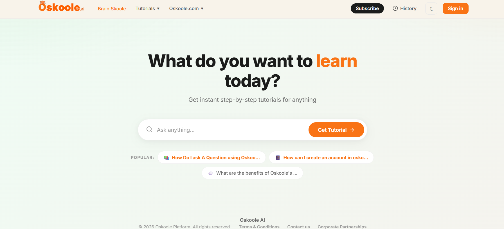
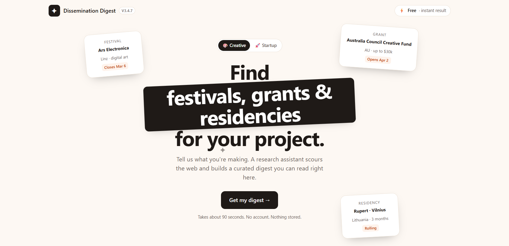

### 🤖 AI Solutions Engineer · Generative AI · Automation · Cloud-Native Systems

Artificial Intelligence Engineer with experience designing and implementing AI-powered solutions, automation initiatives, and data-driven systems within global enterprise environments. My work focuses on bridging technology and business needs through **Generative AI, process automation, analytics, and digital transformation** — throughout my career at **SLB**, I've contributed to AI adoption programs, internal automation solutions, technical enablement initiatives, and operational improvements impacting teams across multiple regions.

As a member of the **AI-Deation Team** and an **AI Literacy Champion**, I've led training programs, developed AI-focused initiatives, and promoted the practical adoption of artificial intelligence to improve productivity, documentation quality, and knowledge sharing across the organization.

Beyond enterprise operations, I actively design, build, and ship my own **AI-driven products** — spanning **LLMs, NLP, real-time streaming architectures, automation workflows, and cloud-native deployments**. I'm particularly focused on **AI Solutions Engineering, AIOps, Automation, Data Engineering, and Cloud Technologies** — building scalable systems that create measurable business impact.

 

# 💻 TECHNOLOGIES 💻

### 🧠 GENERATIVE AI / LLM 🧠

### 🔮 PROGRAMMING LANGUAGES 🔮

### 🧩 FRONT-END 🧩

### 🪄 BACK-END 🪄

### 📍 DATABASES 📍

### ☁️ CLOUD & DEVOPS ☁️

### 🤖 MACHINE LEARNING / ML 🤖

### 💡 OTHER TOOLS 💡

 

 

# 🚀 FEATURED PROJECTS 🚀

Selected AI products I've designed and built end-to-end — both part of **[Eggn.io](https://eggn.io)**, my AI product studio.

 
 

## 1. [Oskoole.ai](https://oskoole.ai) — AI-Powered Learning Platform 🎓🤖

**Tech Lead · Full Stack · AI Developer** — Part of [Eggn.io](https://eggn.io)

Oskoole.ai is an AI-powered platform designed to help low-IT users, particularly older adults, understand technology through interactive step-by-step tutorials generated on demand. Users request help with a technical topic, and the system dynamically generates a structured tutorial using generative AI, progressively delivering instructions with text, voice narration, and visual guidance to make complex digital concepts easier to follow.

From a technical perspective, the platform combines **Large Language Models (LLMs)**, **voice generation**, and a **real-time streaming architecture** to build tutorials as they are generated. **WebSockets** stream tutorial steps dynamically, voice synthesis provides audio guidance, and the system automatically retrieves contextual images to support each step. The backend runs on **PostgreSQL**, with a **containerized deployment (Docker)** and **automated CI/CD pipelines** enabling continuous integration, testing, and deployment.

The project is developed with a focus on **geriatric centers and assisted-living environments**, where institutions can deploy customized AI assistants to support digital literacy and cognitive engagement for their residents.

### Main Features

- **On-demand tutorial generation** — ask about any technical topic and get a structured, step-by-step guide instantly.
- **Real-time streaming delivery** — tutorial steps are streamed progressively over WebSockets as they're generated, not after a long wait.
- **Multi-modal guidance** — synchronized text, AI voice narration, and automatically retrieved contextual images for every step.
- **Accessibility-first design** — built around the needs of low-IT users and older adults.
- **Institutional deployments** — customizable AI assistants for geriatric centers and assisted-living environments.
- **Production-grade infrastructure** — PostgreSQL, Dockerized services, and automated CI/CD pipelines.

### Technologies used

### Project Preview

### Links

- [Live Platform — oskoole.ai](https://oskoole.ai)

 
 

## 2. [Dissemination Digest](https://dissemination.eggn.io) — AI Research Assistant for Creatives 🔍✨

**AI Developer** — Part of [Eggn.io](https://eggn.io)

Dissemination Digest turns hours of manual research into a single 90-second request. A creative practitioner describes their project in a short form, and an **agentic AI research assistant** — powered by the **Anthropic Claude API** with live web search — scours the web and returns a curated digest of relevant festivals, grants, and residencies, delivered instantly in the browser and by email.

The core flow requires no account: Claude autonomously runs live web searches, synthesizes the results into a structured digest, and the platform emails a copy via **Resend** for later reference. An optional persistent workspace (Node.js on a Docker/Coolify deployment) lets returning users save projects and manage subscriptions, while the public-facing form runs serverless on **Cloudflare Pages/Workers** for instant, low-cost scaling.

### Main Features

- **Agentic web research** — Claude autonomously runs live web searches to find real, current opportunities matching the user's project.
- **Zero-friction UX** — no account required for the core flow; a full digest is ready in about 90 seconds.
- **Automated email delivery** — every digest is also emailed for later reference.
- **Optional accounts & subscriptions** — a persistent workspace for saved projects and plan upgrades.
- **Serverless-first architecture** — Cloudflare Pages/Workers for the public flow, with a Node/Docker deployment for stateful features.

### Technologies used

### Project Preview

### Links

- [Live Platform — dissemination.eggn.io](https://dissemination.eggn.io)

 

 

# 📦 EARLIER PROJECTS 📦

Smaller academic/personal projects from earlier in my path — kept here for reference.

 
 

## Cat/Army-DEX 🔫🐈🔫🐈‍⬛

A deterministic, hash-based character generator: any input string (a name, a phrase) is hashed and used to seed a unique, procedurally-generated avatar — rendered as a cat, robot, or monster via the [RoboHash](https://robohash.org/) API. Built to explore deterministic hashing, seeded procedural generation, and third-party API integration behind a React front-end.

### Main Features

- **Deterministic generation** — identical input always maps to the same character; case, spacing, and characters all affect the hash.
- **Pluggable image sets** — swap between cats, robots, and monster heads via the underlying RoboHash category.

### Technologies used

### Links

- [GitHub Repository](https://github.com/DanielOlarte-GitHub/Cat-Army-DEX)

 
 

## OlarTasks 📝✅❌

A full-stack CRUD task manager built on **MySQL, Express, React, and Node.js** to practice RESTful API design, relational data modeling, and state-driven UI updates — supporting create, update, complete, and delete task flows with real-time UI feedback.

### Main Features

- **RESTful API** for task CRUD operations, backed by MySQL.
- **State-driven UI** — task status updates reflect immediately in the interface.
- **Focused single-user flow** — a clean task list without unnecessary complexity.

### Technologies used

### Links

- [GitHub Repository](https://github.com/DanielOlarte-GitHub/OlarTasks)

 

 

# 👉 ABOUT ME 👈

I'm always happy to connect on **AI Solutions Engineering, GenAI, automation, or applied machine learning**.

### ⚡ CONTACT ME ⚡

## ❄️ CV ❄️

 
